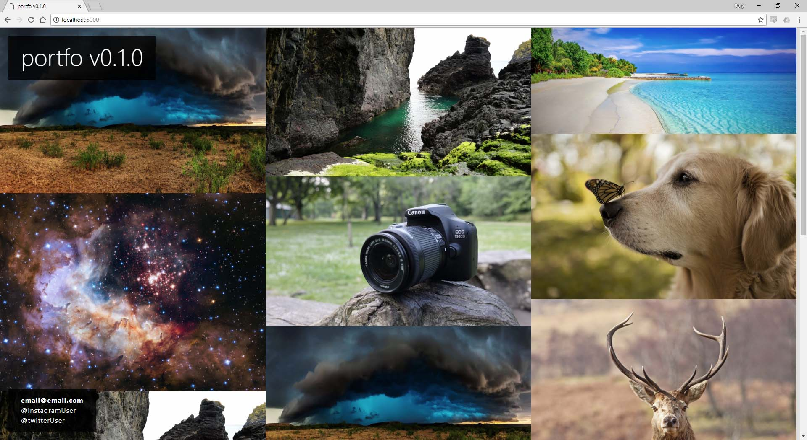

# portfo

Minimal portfolio site.

[Screenshot]


## Features

* User Management
* Design/layout customization
* Portfolio management

## Installation

Currently installation is pretty basic.

```
~/portfo$ pipenv install
~/portfo$ cd portfo
~/portfo/portfo$ pipenv run python app.py
```

## First Steps

After install Portfo a new user will need to be created.
While the app is running hit the following end point:

```
localhost:5000/register
```

Once a user is made, they are automaically assigned a new Folio object that contains all the details related to their portfolio.

## Tests

```
~/portfo$ pipenv run python setup.py
```